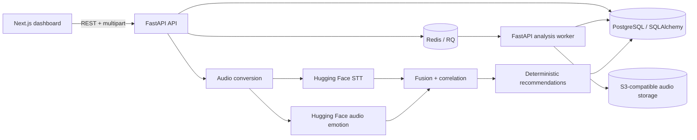

# PitSense AI

PitSense AI is an AI-powered race-engineer dashboard for the “Silent Co-Driver” problem: it turns driver radio into timestamped evidence, classifies vocal state, correlates stress events with lap performance, and produces deterministic, human-reviewable engineering recommendations.

## Architecture



## What is included

- FastAPI backend with SQLAlchemy migrations, team authentication/tenant isolation, secure uploads, CSV/manual lap input, asynchronous Redis/RQ analysis jobs, model adapters, correlation, recommendations, timeline, and JSON/CSV/PDF exports.
- Next.js + TypeScript + Tailwind + Recharts + Lucide React frontend with landing, sessions, workspace, results and methodology views.
- Explicitly labelled demo session fixtures for offline judging. Normal uploads require genuine backend inference and never receive fixture results.
- Tests for backend domain logic/API and frontend utility/state behavior.

## Models

The defaults are environment-configurable Hugging Face model IDs:

- `openai/whisper-tiny` for multilingual speech-to-text with automatic language handling.
- `superb/wav2vec2-base-superb-er` for audio emotion recognition.
- `j-hartmann/emotion-english-distilroberta-base` for optional transcript emotion support.

Models are loaded by the backend with `transformers` and `torch`. Set `HF_TOKEN` for gated/private models if you replace the defaults.

The dependency pin uses PyTorch `>=2.6,<3` because the supplied Python 3.13 runtime does not have a compatible wheel for PyTorch 2.5.1; the requested PyTorch/Transformers stack is otherwise unchanged. Whisper handles multilingual speech; the optional text-emotion model is strongest for English, while audio emotion remains the primary signal for every language.

## Local setup

### Backend (local development)

```powershell
cd backend
python -m venv .venv
.\.venv\Scripts\Activate.ps1
pip install -r requirements.txt
copy .env.example .env
python -m app.seed_demo
uvicorn app.main:app --reload --port 8000
```

### Frontend

```powershell
cd frontend
npm install
copy .env.example .env.local
npm run dev
```

Open http://localhost:3000. The API docs are at http://localhost:8000/docs.

On Windows, after installing the backend dependencies once, you can double-click [start-pitsense.bat](start-pitsense.bat) to launch both services and open the dashboard automatically.

### Docker (PostgreSQL + Redis + worker)

```powershell
copy .env.example .env
docker compose up --build
```

## Environment variables

See [.env.example](.env.example) and [backend/.env.example](backend/.env.example). Important values include `HF_TOKEN`, `HF_STT_MODEL`, `HF_AUDIO_EMOTION_MODEL`, `HF_TEXT_EMOTION_MODEL`, `MAX_UPLOAD_MB`, `MAX_AUDIO_DURATION_SECONDS`, `DATABASE_URL`, `REDIS_URL`, `CORS_ORIGINS`, `STORAGE_BACKEND`, `S3_BUCKET`, `RETENTION_DAYS`, `AUTH_REQUIRED`, and `JWT_SECRET`. Keep tokens only in an untracked `.env`; the example file intentionally contains no secret.

## CSV format

Required columns: `lap_number,lap_time_seconds`. Optional timestamp columns: `start_timestamp_seconds,end_timestamp_seconds`. Timing must come from real telemetry or a timing sheet. PitSense never converts audio duration into a fake lap.

```csv
lap_number,lap_time_seconds,start_timestamp_seconds,end_timestamp_seconds
1,92.431,0,92.431
2,91.882,92.431,184.313
```

## API overview

Authentication: `POST /api/auth/register`, `POST /api/auth/login`, `GET /api/me`, `GET /api/organizations`.

Sessions: `POST /api/sessions`, `GET /api/sessions`, `GET /api/sessions/{id}`, `DELETE /api/sessions/{id}`.

Analysis: `POST /api/sessions/{id}/analyse` returns `202` with a `job_id`; poll `GET /api/jobs/{job_id}`, cancel with `POST /api/sessions/{id}/analysis/cancel`, and retry failed jobs with `POST /api/jobs/{job_id}/retry`.

Audio/laps/reports: audio upload/replace/delete, lap CSV/manual endpoints, `GET /timeline`, `GET /report`, and JSON/CSV/PDF exports. Health endpoints are `GET /health`, `GET /readiness`, and `GET /models/status`.

## Demo instructions

1. Seed the demo with `python -m app.seed_demo` from `backend`.
2. Start both services. The seeded demo is explicitly labelled and may use fixture results; ordinary uploads always use backend Hugging Face inference.
3. Click “Open demo session” on the landing page.
4. Play the bundled self-created WAV, inspect the transcript and markers, then open the results view.

Demo fixtures are clearly marked in the UI and API. They are only used for the seeded demo session when `DEMO_MODE=true`.

## Tests

```powershell
cd backend; pytest
cd frontend; npm test
```

## Limitations and privacy

Audio is processed by the backend and is not sent to an external LLM. In production, use S3-compatible object storage with short-lived signed access URLs and run `python -m app.retention` daily to enforce the 30-day default retention. Hugging Face model downloads/inference may require network access, RAM, and a token depending on the selected model. The correlation baseline identifies associations, not causation, and does not provide medical or psychological diagnoses. Delete a session to remove its database rows and uploaded audio.

Further detail: [docs/architecture.md](docs/architecture.md), [docs/ai-pipeline.md](docs/ai-pipeline.md), [docs/demo-script.md](docs/demo-script.md), and [docs/judging-pitch.md](docs/judging-pitch.md).

Production deployment guidance: [docs/production-runbook.md](docs/production-runbook.md).
