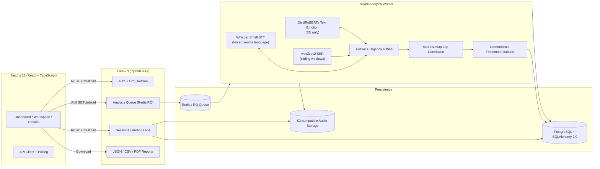

# PitSense AI

**Hear the signal. Change the lap.**

PitSense AI is an AI-powered race-engineer dashboard for the **"Silent Co-Driver" problem**: it turns driver radio into timestamped evidence, classifies vocal state, correlates stress events with lap performance, and produces deterministic, human-reviewable engineering recommendations.

---

## Architecture



**Key boundaries**:
- Frontend **never** talks to Hugging Face models. All inference runs in the backend worker.
- Audio **never leaves** backend storage. No external LLMs.
- Reports are **schema-versioned JSON** stored in `AnalysisJob.result_json` — reproducible, auditable.
- Multi-tenant isolation via `organization_id` on every session; membership checked on every access.

---

## What Is Included

| Layer | Capabilities |
|-------|--------------|
| **Backend (FastAPI)** | SQLAlchemy + Alembic migrations, JWT auth with org-scoped tokens, secure audio upload/replace/delete (MIME + magic-byte validation, ClamAV optional), CSV/manual lap import with timestamp validation, async Redis/RQ analysis queue with phase-level progress, cancellation, retry-with-backoff, timeout watchdog, model adapter system (baseline → promoted → calibrated candidate), deterministic correlation & recommendation engine, schema-versioned report storage, JSON/CSV/PDF exports. |
| **Frontend (Next.js 16)** | Landing page with problem/impact/hero, dashboard with metric cards + recent activity, session workspace (upload, laps, mode select, live processing panel), results dashboard (transcript, events, lap chart, state distribution, recommendations, exports), analytics (filterable/sortable session table), onboarding (3 steps), settings (profile/preferences/security/session), methodology docs, login/register with password visibility. |
| **Demo Fixtures** | Seeded session (`python -m app.seed_demo`) with synthetic 42s WAV, hand-crafted transcript, 5 emotion windows (Calm×2, Stressed, Urgent, Tired), 8 real laps (laps 4–5 deteriorated), complete lap-correlated report. **Explicitly labelled** in UI (`is_demo=true`, "Explicit demo fixture" badge) and API. Normal uploads **never** use fixtures. |
| **Tests** | Backend: API health/auth/upload validation/mutation locking, domain logic (correlation, recommendations), ML pipeline (label normalization, fusion). Frontend: validation utils, component state behavior. |

---

## Models

| Component | Default Model | Purpose |
|-----------|---------------|---------|
| **Speech-to-Text** | `openai/whisper-small` | Multilingual STT, forced source-language transcription (`task=transcribe`, explicit `language=en`) to prevent English→Spanish misdecode on short noisy clips. |
| **Audio Emotion (baseline)** | `superb/wav2vec2-base-superb-er` | Sliding-window SER (8s windows, 4s step). Primary signal for all languages. Low-confidence/ambiguous → `uncertain`. |
| **Text Emotion (optional)** | `j-hartmann/emotion-english-distilroberta-base` | English-only transcript emotion. Fused with audio + urgency signals. |
| **Embeddings (promoted path)** | `microsoft/wavlm-base-plus` | Frozen WavLM embeddings for trainable race-radio classifier (activated only after 99% held-out gate). |

**Model Promotion Gates** (unique to PitSense):
1. **Training**: Speaker-labeled CSV → `python -m app.ml.train` → joblib artifact (WavLM embeddings + calibrated classifier + fusion head).
2. **Validation**: Untouched speaker-held-out test set must reach **99% balanced-accuracy AND macro-F1**.
3. **Promotion**: Only after gate passes does artifact activate. UI shows `promotion_state: "legacy_promoted"` honestly.
4. **Benchmark Candidates**: Separate GPU workflow compares version-pinned adapters against baseline via identical calibration head. Requires **signed manifest** (safety, coverage, language, license gates) before activation. Baseline remains generic SER until signed promotion.

---

## Demo Instructions for Judges

### Quick Start (30 seconds)

Use Python 3.11 for the pinned backend dependency set (`backend/.python-version`). The seeded demo is offline after dependencies are installed; normal analysis additionally needs the configured model weights.

```powershell
# 1. Backend
cd backend
powershell -ExecutionPolicy Bypass -File .\setup-windows.ps1
.\.venv311\Scripts\Activate.ps1
python -m app.seed_demo
uvicorn app.main:app --reload --port 8000

# 2. Frontend (new terminal)
cd frontend
npm install
copy .env.example .env.local
npm run dev
```

**Open**: `http://localhost:3000` → Click **"Explore demo session"** → Session loads instantly (seeded fixture).

> **Windows one-click**: Double-click `start-pitsense.bat` after first `pip install` / `npm install`.

To reset only the labelled demo fixture and recreate it, run `python -m app.seed_demo --reset` from `backend`. This does not delete normal user sessions.

### 2-Minute Demo Flow

| Step | Action | What You See |
|------|--------|--------------|
| 1 | Land on homepage | Hero + live telemetry shell (STRESSED 86%) |
| 2 | Click **"Explore demo session"** | Redirects to `/sessions/{demo_id}` |
| 3 | Session workspace | Audio player (play 42s synthetic WAV), lap table (8 laps, laps 4–5 +3.5s vs median), status: **Analysed** |
| 4 | Results dashboard | **Overall state: Calm 91%**, **Highest-risk: Urgent 91%**, lap chart with evidence markers and supplied timing summary |
| 5 | Click the urgent evidence card | Audio seeks to 22s, transcript highlights *"Box now, there is smoke..."*, **Critical recommendation**: investigate car condition |
| 6 | Scroll to recommendations | 2 deterministic recommendations: stress-event deterioration and urgent-event performance loss |
| 7 | Click **JSON** export | Downloads `pitsense-{id}-report.json` with full provenance |

**All demo data is labelled**: "Explicit demo fixture" in header, `is_demo=true` in API, fixture badges in lists.

---

## Local Setup (Detailed)

### Backend (local development)

```powershell
cd backend
powershell -ExecutionPolicy Bypass -File .\setup-windows.ps1
.\.venv311\Scripts\Activate.ps1
# Edit .env: set HF_TOKEN if using gated models, or leave for open models
python -m app.seed_demo
uvicorn app.main:app --reload --port 8000
```

### Frontend

```powershell
cd frontend
npm install
copy .env.example .env.local
npm run dev
```

Open `http://localhost:3000`. API docs at `http://localhost:8000/docs`.

### Docker (PostgreSQL + Redis + Worker)

```powershell
copy .env.example .env
# Edit .env: set POSTGRES_PASSWORD, JWT_SECRET, HF_TOKEN
docker compose up --build
```

Services: Frontend `3000`, Backend `8000`, Postgres `5432`, Redis `6379`, Worker (background).

---

## Environment Variables

| Variable | Description | Required? |
|----------|-------------|-----------|
| `HF_TOKEN` | Hugging Face token for gated models | Only for gated models |
| `HF_STT_MODEL` | STT model ID (default: `openai/whisper-small`) | No |
| `STT_LANGUAGE` | Whisper language code (default: `en` for forced English) | No |
| `HF_AUDIO_EMOTION_MODEL` | Audio SER model ID (default: `superb/wav2vec2-base-superb-er`) | No |
| `HF_TEXT_EMOTION_MODEL` | Text emotion model ID (default: `j-hartmann/emotion-english-distilroberta-base`) | No |
| `DATABASE_URL` | PostgreSQL DSN (default: SQLite `./pitsense.db`) | Prod: Yes |
| `REDIS_URL` | Redis DSN (default: none → local thread fallback) | Prod: Yes |
| `CORS_ORIGINS` | Comma-separated allowed origins (default: `http://localhost:3000,http://127.0.0.1:3000`) | Prod: Yes |
| `STORAGE_BACKEND` | `local` or `s3` (default: `local`) | Prod: `s3` |
| `S3_BUCKET` | S3 bucket name | If `s3` |
| `S3_REGION` | AWS region (default: `us-east-1`) | If `s3` |
| `S3_ENDPOINT_URL` | Custom S3 endpoint (MinIO, R2) | If non-AWS |
| `AUTH_REQUIRED` | `true`/`false` (default: `false` dev) | Prod: `true` |
| `JWT_SECRET` | HS256 secret (min 32 chars) | Prod: Yes |
| `JWT_EXPIRY_MINUTES` | Token TTL (default: `720`) | No |
| `MAX_UPLOAD_MB` | Audio size limit (default: `25`) | No |
| `MAX_AUDIO_DURATION_SECONDS` | Duration limit (default: `900`) | No |
| `MODEL_TIMEOUT_SECONDS` | Worker timeout (default: `900`) | No |
| `RETENTION_DAYS` | Auto-purge age (default: `30`) | No |
| `DEMO_MODE` | Enable fixture results for demo session (default: `true`) | No |
| `ENVIRONMENT` | `development` or `production` | Prod: `production` |

Keep secrets in untracked `.env`; `.env.example` contains no secrets.

---

## CSV Format (Lap Timing)

Required columns: `lap_number,lap_time_seconds`
Optional timestamp columns: `start_timestamp_seconds,end_timestamp_seconds`

**Timing must come from real telemetry or a timing sheet. PitSense never converts audio duration into a fake lap.**

```csv
lap_number,lap_time_seconds,start_timestamp_seconds,end_timestamp_seconds
1,92.431,0,92.431
2,91.882,92.431,184.313
3,92.106,184.313,276.419
```

---

## API Overview

| Category | Endpoints |
|----------|-----------|
| **Auth** | `POST /api/auth/register`, `POST /api/auth/login`, `GET /api/me`, `GET /api/organizations`, `POST /api/onboarding/complete` |
| **Sessions** | `POST /api/sessions`, `GET /api/sessions`, `GET /api/sessions/{id}`, `DELETE /api/sessions/{id}` |
| **Audio** | `POST /api/sessions/{id}/audio`, `GET /api/sessions/{id}/audio/{clip_id}/file`, `POST /api/sessions/{id}/audio/{clip_id}/replace`, `DELETE /api/sessions/{id}/audio/{clip_id}` |
| **Laps** | `POST /api/sessions/{id}/laps/csv`, `POST /api/sessions/{id}/laps/manual`, `GET /api/sessions/{id}/laps` |
| **Analysis** | `POST /api/sessions/{id}/analyse` → `202 {job_id}`, `GET /api/jobs/{job_id}` (poll), `POST /api/jobs/{job_id}/retry`, `POST /api/sessions/{id}/analysis/cancel` |
| **Results** | `GET /api/sessions/{id}/timeline`, `GET /api/sessions/{id}/report`, `GET /api/sessions/{id}/exports/report.json\|.csv\|.pdf` |
| **Models** | `GET /api/models/status`, `GET /api/models/benchmark` |
| **Health** | `GET /api/health`, `GET /api/readiness` |

---

## Tests

```powershell
# Backend
cd backend; pytest -v

# Frontend
cd frontend; npm test
cd frontend; npm run lint
cd frontend; npm run build
```

The production build check is `cd frontend; npm run build`.

**Backend coverage**: API contracts, auth flow, upload validation, mutation locking, domain logic (correlation, recommendations), ML pipeline (label normalization, fusion).

**Frontend coverage**: Validation utils, component state behavior (processing panel, results dashboard).

---

## Limitations & Privacy

- **Audio processed locally** — never sent to external LLMs or SaaS inference.
- **Production storage**: Use S3-compatible object storage with short-lived signed URLs (5 min TTL).
- **Retention**: Run `python -m app.retention` daily (or cron) to enforce 30-day default purge of sessions + audio.
- **Model downloads**: First worker start downloads HF weights (~2 GB). Requires network + RAM.
- **Correlation baseline**: Identifies **associations**, not causation. Does not provide medical/psychological diagnoses.
- **Data deletion**: `DELETE /api/sessions/{id}` removes DB rows + uploaded audio.

---

## Documentation

| Document | Purpose |
|----------|---------|
| [`docs/architecture.md`](docs/architecture.md) | Detailed system architecture |
| [`docs/ai-pipeline.md`](docs/ai-pipeline.md) | STT → SER → Fusion → Correlation → Rules deep dive |
| [`docs/model-training.md`](docs/model-training.md) | Speaker-held-out training & 99% gate |
| [`docs/model-benchmark.md`](docs/model-benchmark.md) | GPU benchmark workflow & signed promotion |
| [`docs/production-runbook.md`](docs/production-runbook.md) | Deployment, scaling, observability |

---

## Technical Highlights for Judges

1. **Forced source-language STT** — Whisper misclassifies short noisy English as Spanish. We enforce `task=transcribe, language=en` and persist detected language per segment. No fabricated language labels.
2. **Duration-weighted event fusion** — Sliding windows merged by label, confidence weighted by duration, fused with text+urgency only for English. Low-confidence → `uncertain`, never forced.
3. **Maximum-overlap lap correlation** — Events map to real lap with greatest temporal overlap, not window start. Lap times from telemetry — **never inferred from audio duration**.
4. **Promotion-gated model updates** — 99% speaker-held-out balanced-accuracy gate + signed benchmark manifest required. Teams never get silently degraded models.
5. **Inspectable evidence chain** — Every recommendation traces to raw model output + lap overlap + source-language transcript. Provenance in every export.
6. **Privacy-first, air-gappable** — Runs on-team hardware. No cloud inference dependency. Audio never leaves your infrastructure.

---

## Business Context

| Tier | Price | Target | Key Differentiator |
|------|-------|--------|-------------------|
| **Free** | $0 | Individual engineer | 5 sessions/mo, audio-only, JSON/CSV |
| **Pro** | $199/mo/engineer | Serious teams | Unlimited, lap correlation, PDF, API |
| **Team** | $799/mo/org | Organizations | Shared workspace, RBAC, SLA, SSO |
| **Enterprise** | Custom | OEMs/Series | Air-gapped, model governance, on-prem GPU |

**Buyer**: Technical Director / Team Principal. **Champion**: Race Engineer (saves 3.5h/session manual review).

---

## Team

Built by engineers who've sat on the pit wall and felt the Silent Co-Driver gap.

---

## License

MIT — see `LICENSE` for details.
