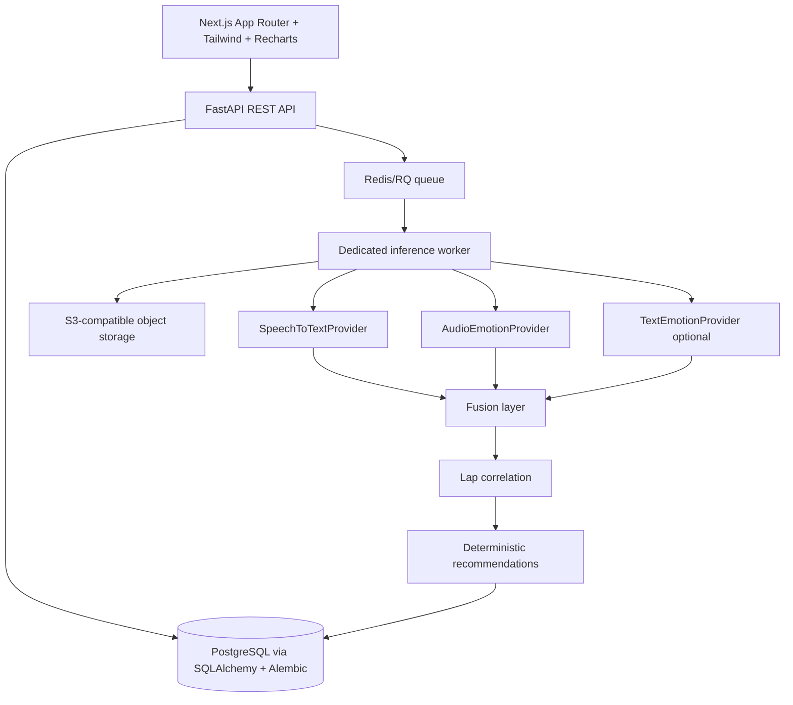

# Architecture

The provider interfaces isolate Hugging Face implementation details from domain logic. All normal user uploads call the real providers. The only fixture branch is the explicitly seeded `is_demo` session when `DEMO_MODE=true`. Local development can use SQLite and local files; production startup rejects SQLite, missing Redis, missing team auth, and missing S3 configuration.

Every session belongs to an organization when authentication is enabled. Analysis selects one active clip, returns a job ID, and stores provenance and the selected analysis mode. The frontend and API are deployable separately: Next.js on Vercel, FastAPI and worker on Render/Fly/Railway, with managed PostgreSQL, Redis, and S3-compatible storage.
